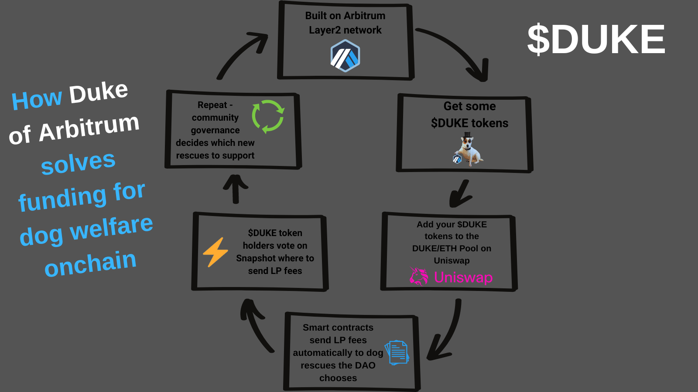

# 👋 Welcome to Duke of Arbitrum!


**About this project:** $DUKE is a memecoin that intends to develop into a MemeFi project with the aim of helping dogs all over the world.


<figure><figcaption>
The DukeWheel
</figcaption></figure>

How to use it?

This space is designed to be read not in a linear fashion: feel free to jump around wherever you would like to.

Contributing

If you want to contribute changes, start a new change request and submit it for review. We need all the contributors we can find!

